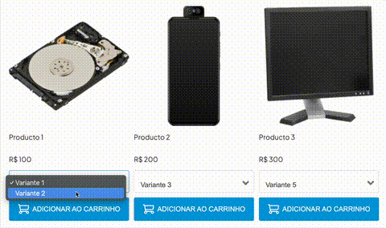

# Example of recommendation app with NubeSDK

Example of a recommendation application implementation with NubeSDK.

This demo contains the base structure, without any major customization of the components, focusing only on functionality.

Feel free to copy and modify the code.

## Available Scripts

### Development

- `npm run dev` - Starts local development server
- `npm run build` - Builds the project using tsup
- `npm test` - Runs unit tests
- `npm run test:watch` - Runs tests in watch mode (automatically re-runs when changes are detected)
- `npm run test:coverage` - Runs tests and generates a coverage report

### Code Quality

- `npm run format` - Formats all project files using Biome
- `npm run lint` - Runs linting on all project files using Biome

## Technologies Used

- [TypeScript](https://www.typescriptlang.org/)
- [Vitest](https://vitest.dev/) for testing
- [Biome](https://biomejs.dev/) for formatting and linting
- [tsup](https://tsup.egoist.dev/) for building
